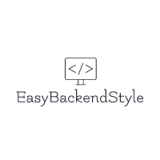

<!-- PROJECT LOGO -->
<br />
<div align="center">
  <a href="https://github.com/github_username/repo_name">
    
  </a>

<h3 align="center">EasyBackendStyle</h3>

  <p align="center">
    This Wordpress plugin allows you to easily customize the colors in the backend of wordpress. 
    The changes are easily possible via predefined fields, as well as via custom CSS.
    <br />
    <br />
    <a href="https://github.com/github_username/repo_name/issues">Report Bug</a>
    ·
    <a href="https://github.com/github_username/repo_name/issues">Request Feature</a>
  </p>
</div>


<!-- TABLE OF CONTENTS -->
<details>
  <summary>Table of Contents</summary>
  <ol>
    <li>
      <a href="#about-the-project">About The Project</a>
    </li>
    <li>
      <a href="#getting-started">Getting Started</a>
      <ul>
        <li><a href="#installation">Installation</a></li>
      </ul>
    </li>
    <li><a href="#usage">Usage</a></li>
    <li><a href="#roadmap">Roadmap</a></li>
    <li><a href="#license">License</a></li>
    <li><a href="#contact">Contact</a></li>
  </ol>
</details>


<!-- ABOUT THE PROJECT -->
## About The Project

[![Product Name Screen Shot][product-screenshot]](https://example.com)

<p align="right">(<a href="#readme-top">back to top</a>)</p>


<!-- GETTING STARTED -->
## Getting Started

This is an example of how you may give instructions on setting up your project locally.
To get a local copy up and running follow these simple example steps.

### Installation

#### Manual Installation

1. Clone the repo or download the .zip archive
   ```sh
   git clone https://github.com/farndesign/easyBackendStyle.git
   ```
   or
   Download: https://github.com/farndesign/easyBackendStyle/archive/refs/heads/main.zip
   
2. Add the plugin files to the Wordpress instance.
  - Create a new Folder in: `/wp-content/plugins/easyBackendStyle`
  - Move all files into the new `easyBackendStyle` folder

3. Activate the plugin at the Wordpress plugin page http://localhost/wp-admin/plugins.php

#### Via Wordpress Plugin Store

1. TODO

<p align="right">(<a href="#readme-top">back to top</a>)</p>


<!-- USAGE EXAMPLES -->
## Usage

After activating, the settings page can be found as a subpage of the settings section.

At the settings page you can change the color of the different elements. The changes are applied after saving.

In addition, custom CSS can be added. This is always executed additionally and overwrites other content. 

<p align="right">(<a href="#readme-top">back to top</a>)</p>


<!-- ROADMAP -->
## Roadmap

- [ ] Live preview of the changes
- [ ] Think about more Features

See the [open issues](https://github.com/farndesign/easyBackendStyle/issues) for a full list of proposed features (and known issues).

<p align="right">(<a href="#readme-top">back to top</a>)</p>


<!-- LICENSE -->
## License

Distributed under the GNU 3.0 License. See `LICENSE.md` for more information.

<p align="right">(<a href="#readme-top">back to top</a>)</p>


<!-- CONTACT -->
## Contact

Farn - digital brand design https://www.farn.de/

Project Link: https://github.com/farndesign/easyBackendStyle

<p align="right">(<a href="#readme-top">back to top</a>)</p>


<!-- MARKDOWN LINKS & IMAGES -->
<!-- https://www.markdownguide.org/basic-syntax/#reference-style-links -->
[issues-url]: https://github.com/farndesign/easyBackendStyle/issues
[license-url]: https://github.com/farndesign/easyBackendStyle/blob/main/LICENCE.md
[product-screenshot]: images/settingsPage.png
